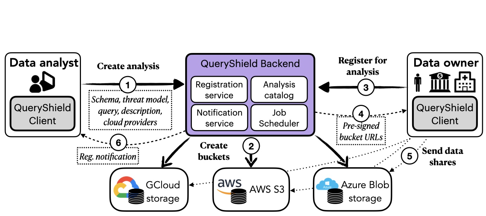
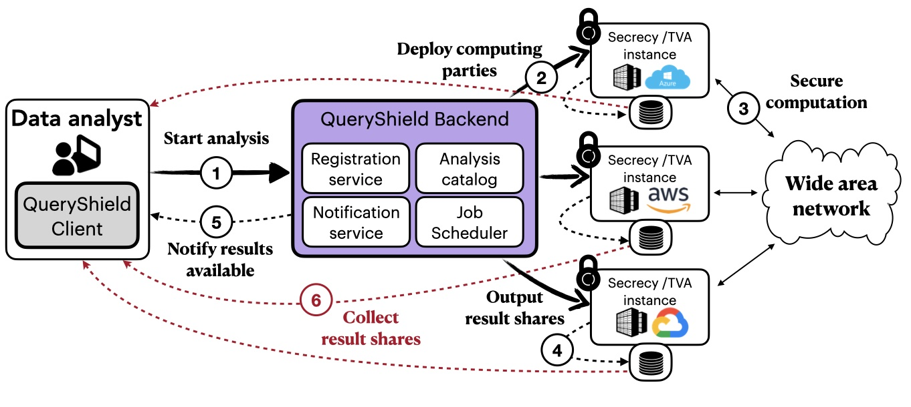

# QueryShield: Cryptographically Secure Analytics in the Cloud

## Introduction
QueryShield is a secure multiparty computation (MPC) cloud service. It leverages the power of cryptographic techniques to enable collaborative computation among multiple parties without compromising the privacy of their data. QueryShield is built upon the [Secrecy](https://github.com/CASP-Systems-BU/Secrecy) and [TVA](https://github.com/CASP-Systems-BU/tva) systems, offering a frontend and an automated backend to facilitate secure computations for users with no prior MPC knowledge.

### Key Features
- Two flavors of secret sharing: Supports both arithmetic and boolean secret shares to accommodate a wide range of computational needs.
- User-Friendly interface: Designed with an easy-to-use frontend to simplify user interaction with the system.
- Automated backend: Automates the computation process, making secure MPC accessible to a broader audience.

## System Overview
QueryShield distinguishes between two primary user roles: data analysts and data owners, each with distinct functionalities within the system.

### Workflow: Phase 1 
1. A data analyst creates and publishes an analysis in the analysis catalog
2. QueryShield sets up buckets for storing secret shares
3. Data owners browse the catalog and register for an analysis
4. Data owners receive pre-signed bucket URLs
5. Data owners upload secret shares of their data to buckets
6. Data analyst is notified about registered users (happens asynchronously)

  

### Workflow: Phase 2 
1. Data analyst starts an analysis
2. QueryShield creates cloud VMs and deploys the Secrecy/TVA software 
3. QueryShield starts the secure computation 
4. Parties store the result shares in the output buckets
5. The analyst is notified and retrieves shares of the result

  

### Data Analyst Role
Analysts can create analysis tasks and publish their descriptions in a catalog maintained by the service. They can also schedule analysis jobs for execution in available cloud providers, monitor the computation progress, and view the results when the job is done.

### Data Owner Role
Data owners can view the catalog to decide whether they want to register for an analysis and contribute secret shares of their private data. Data owners upload secret shares using unique pre-signed URLs generated by QueryShield without the need to create accounts in the respective clouds.

## Libraries Used

1. [Axios](https://axios-http.com/) - A promise-based HTTP client for the browser and Node.js

2. [Firebase](https://firebase.google.com/) - A comprehensive app development platform

3. [Flask](https://flask.palletsprojects.com/) - A micro web framework written in Python, designed for simplicity and ease of use in building web applications.

4. [jspreadsheet-ce](https://bossanova.uk/jspreadsheet/v5/) - A JavaScript spreadsheet library

5. [React](https://reactjs.org/) - A JavaScript library for building user interfaces

6. [React Bootstrap](https://reactbootstrap.github.io/) - A front-end framework

7. [React Icons](https://react-icons.github.io/react-icons/) - Include popular icons in your React projects easily

8. [Ansible Playbook](https://docs.ansible.com/ansible/latest/user_guide/playbooks.html) - An open-source automation tool that simplifies the configuration management, application deployment, and task automation processes in IT environments.
  
9. [Web Crypto API](https://developer.mozilla.org/en-US/docs/Web/API/Web_Crypto_API) - The Web Crypto API, developed by the World Wide Web Consortium (W3C), provides a set of cryptographic functionalities that enable secure communication and data integrity on the web.

